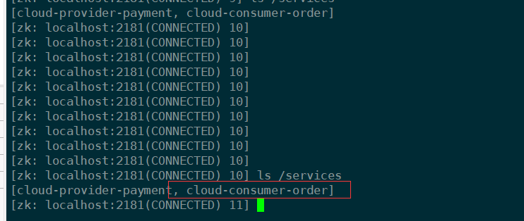
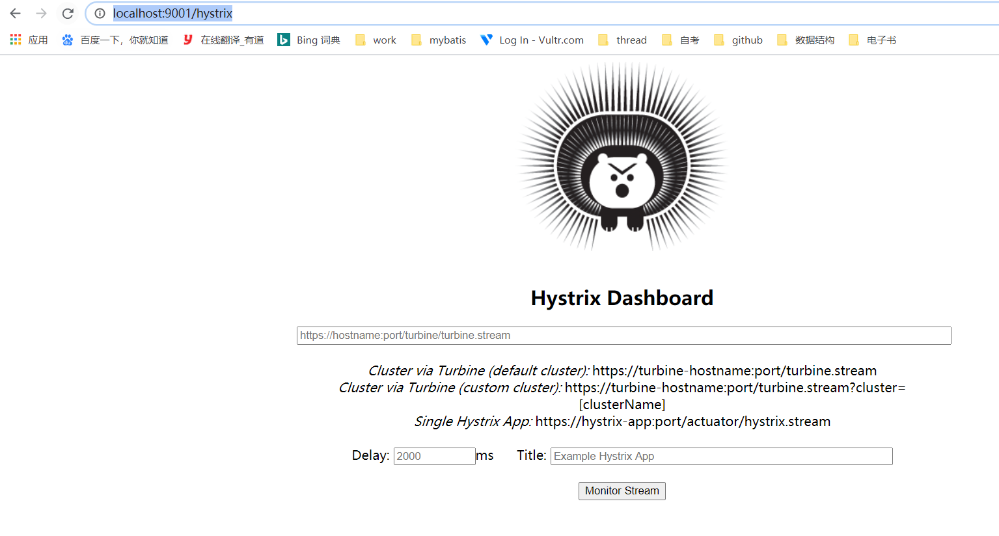

# learn-spring-cloud结合 spring-cloud-alibaba 比较新版学习

1、创建一个简单的父工程 learn-spring-cloud，然后修改pom.xml文件中依赖。
```
spring-boot和spring-cloud
版本选择，
这里spring-boot使用2.2.2.RELEASE， 
spring-cloud版本是 Hoxton.SR1, 
spring.cloud.alibaba 2.1.0.RELEASE
```

2、创建一个子模块module,cloud-provider-payment8001, 修改依赖并添加配置文件。
创建实体类Payment 和公用返回CommonResult类，对应的dao层， paymentDao, 业务层接口PaymentService，
以及实现层PaymentServiceImpl, 还有控制层PaymentController
示例控制层:
```java
package com.learn.springcloud.controller;

import com.learn.springcloud.entities.CommonResult;
import com.learn.springcloud.entities.Payment;
import com.learn.springcloud.service.PaymentService;
import lombok.extern.slf4j.Slf4j;
import org.springframework.web.bind.annotation.GetMapping;
import org.springframework.web.bind.annotation.PathVariable;
import org.springframework.web.bind.annotation.PostMapping;
import org.springframework.web.bind.annotation.RestController;
import javax.annotation.Resource;
/**
 * @ClassName: PaymentController
 * @Description:
 * @Author: lin
 * @Date: 2020/8/15 22:20
 * History:
 * @<version> 1.0
 */
@RestController
@Slf4j
public class PaymentController {

    @Resource
    private PaymentService paymentService;

    @PostMapping(value = "/payment/create")
    public CommonResult create(@RequestBody  Payment payment){
        int result = paymentService.create(payment);
        log.info("*****插入结果:" + result);

        if(result > 0){
            return  new CommonResult(200, "插入成功", result);
        }else {
            return  new CommonResult(444, "插入失败", null);
        }
    }

    @GetMapping(value = "/payment/get/{id}")
    public CommonResult getPaymentById(@PathVariable("id") Long id){
        Payment payment = paymentService.getPaymentById(id);
        log.info("*****查询结果:" + payment);

        if(payment != null){
            return  new CommonResult(200, "查询成功", payment);
        }else {
            return  new CommonResult(444, "没有对应记录，查询id:"+id, null);
        }
    }
}

```
请求测试：http://localhost:8001/payment/get/23 ，返回的是json数据格式 ，如图所示


插入使用postman测试


开启热部署
``` 
1:添加依赖devtools
2:在父类工作中添加springboot maven plugin插件
3:设置 Enabling automatic build
4:update the value of
5:重启idea
```

设置：

上面的是一个服务的时候，如果有其他的服务来调用的时候怎么办？

3、创建一个新的mould模块，cloud-consumer-order80，添加相关配置并且将实体类copy到这个mould中来。
两个服务之间调用最原始的是通过http来调用，还有一个是restTemplate。这里先使用 restTemplate来进行调用
```
restTemplate 提供了多种便捷访问远程Http服务的方法，是一种简单便捷的访问Restful服务模板类，是spring
提供的用于访问Rest服务的客户端模板工具集。

```
添加一个config
```java
package com.learn.springcloud.config;

import org.springframework.context.annotation.Bean;
import org.springframework.context.annotation.Configuration;
import org.springframework.web.client.RestTemplate;
/**
 * @ClassName: ApplicationContextConfig
 * @Description:
 * @Author: lin
 * @Date: 2020/8/15 23:34
 * History:
 * @<version> 1.0
 */
@Configuration
public class ApplicationContextConfig {

    @Bean
    public RestTemplate getRestTemplate(){
        return  new RestTemplate();
    }
}

```

服务的提供者：cloud-provider-payment8001 ,服务的消费者：cloud-consumer-order80
使用 http://localhost/consumer/get/23 调用服务消费者，其实是调用的服务提供中的方法。


在运行时候，使用run Dashboard的组件,如果没有显示 那么就到这个项目中idea 目录下中workspace.xml添加 下面的组件。再次运行就可以看到了
``` 
<component name="RunDashboard">
    <option name="configurationTypes">
      <set>
        <option value="SpringBootApplicationConfigurationType" />
      </set>
    </option>
    <option name="ruleStates">
      <list>
        <RuleState>
          <option name="name" value="ConfigurationTypeDashboardGroupingRule" />
        </RuleState>
        <RuleState>
          <option name="name" value="StatusDashboardGroupingRule" />
        </RuleState>
      </list>
    </option>
  </component>
```
3、上面的两个模块中存在一个问题，相同的类在两个模块中都出现了，所有我们将相同地类提出来放到一个公用的模块中去，
所以这里新建立一个模块。cloud-api-commons

4、使用eureka来进行服务注册,创建新模块 cloud-eureka-server7001
```
Eureka包含两个组件：Eureka Server和Eureka Client
Eureka Server 提供服务注册服务
 各个微服务节点通过配置启动后，会在Eureka Server中进行注册，这样Eureka Server中的服务注册表这将会存储所有可能
服务节点的信息，服务节点的信息可以在界面中直观看到。

Eureka Client通过注册中进行访问
 是一个java客户端，用于简化Eureka Server的交互，客户端同时也具备一个内置的，使用轮询负载算法的负载均衡器。在应用
启动后，将会向Eureka Server发送心跳(默认周期为30秒)。如果Eureka Server在多个心跳周期内没有接收到某个节点的心跳。
Eureka Server将会从服务注册表中把这个服务节点移除（默认90s）

```
修改eureka服务的yml配置文件。添加启动类
```java
package com.learn.springcloud;
import org.springframework.boot.SpringApplication;
import org.springframework.boot.autoconfigure.SpringBootApplication;
import org.springframework.cloud.netflix.eureka.server.EnableEurekaServer;
/**
 * @ClassName: EurekaMain7001
 * @Description:
 * @Author: lin
 * @Date: 2020/8/16 16:46
 * History:
 * @<version> 1.0
 */
@SpringBootApplication
@EnableEurekaServer
public class EurekaMain7001 {
    public static void main(String[] args) {
        SpringApplication.run(EurekaMain7001.class, args);
    }
}
```
启动eureka注册中心，可以看到当前还没有服务注册进去


5、将服务提供者注册到eureka中，那么修改provider和consumer启动类，添加EurekaClient注解。
```java
package com.learn.springcloud;

import org.springframework.boot.SpringApplication;
import org.springframework.boot.autoconfigure.SpringBootApplication;
import org.springframework.cloud.netflix.eureka.EnableEurekaClient;

/**
 * @ClassName: PaymentMain8001
 * @Description:
 * @Author: lin
 * @Date: 2020/8/15 21:29
 * History:
 * @<version> 1.0
 */
@SpringBootApplication
@EnableEurekaClient
public class PaymentMain8001 {
    public static void main(String[] args) {
        SpringApplication.run(PaymentMain8001.class, args);
    }
}

```
并且修改pom文件。添加eurekaClient依赖
```
  <!-- eureka-client -->
        <dependency>
            <groupId>org.springframework.cloud</groupId>
            <artifactId>spring-cloud-starter-netflix-eureka-client</artifactId>
        </dependency>

```
修改application.yml配置文件，让服务提供组注册到 注册中心去
```
eureka:
  client:
    #表示是否将自己注册进EurekaServer默认为true
    register-with-eureka: true
    #是否从EurekaServer抓取已有的注册消息，默认为true，单节点无所谓，
    #集群必须设置为true才能配合ribbon使用负载均衡
    fetch-registry: true
    service-url:
      #集群版
      #defaultZone: http://eureka7001.com:7001/eureka/,http://eureka7002.com:7002/eureka/
      #单机版
#      defaultZone: http://eureka7001.com:7001/eureka/
      defaultZone: http://localhost:7001/eureka/
  instance:
    instance-id: payment8001
    prefer-ip-address: true #访问路径可以显示ip
    #Eureka客户端向服务端发送心跳的实际间隔，单位为秒（默认为30秒）
    lease-renewal-interval-in-seconds: 1
    #Eureka服务端收到最后一次心跳后等待时间上线，单位为秒（默认为90秒） 超时将剔除服务
    lease-expiration-duration-in-seconds: 2 
```
启动服务提供者，然后刷新注册中心，就可以看到这个服务提供者已经注册到 eureka中去了。
在下面的图中可以一行红色字，它是eureka的自我保护机制。


6、修改服务消费consumer的启动类 
```java
package com.learn.springcloud;

import org.springframework.boot.SpringApplication;
import org.springframework.boot.autoconfigure.SpringBootApplication;
import org.springframework.cloud.netflix.eureka.EnableEurekaClient;

/**
 * @ClassName: OrderMain80
 * @Description:
 * @Author: lin
 * @Date: 2020/8/15 23:26
 * History:
 * @<version> 1.0
 */
@EnableEurekaClient
@SpringBootApplication
public class OrderMain80 {

    public static void main(String[] args) {
        SpringApplication.run(OrderMain80.class, args);
    }
}

```
在pom文件中添加eurekaClient依赖，并且修改yml文件让其服务消费者也注册到eureka中去。修改之后刷新注册中
可以看到consumer也已经注册到eureka中了。


注意：在yml配置文件，需要注意层次缩进和空格。不然会报错
```
Failed to bind properties under 'eureka.client.service-url' to java.util.map<java.lang.String,java.lang.String>
```

7、eureka集群构建
```
Eureka
服务注册：将服务信息注册进注册中心
服务发现：从注册中心获取服务信息
实质：存key服务名，取value调用地址

1:启动eureka注册中心
2:启动服务提供者payment支付服务
3:支付服务启动后会把自身信息(比如服务地址以别名方式注册进eureka)
4:消费者order服务在需要调用接口时，使用服务别名去注册中心获取实际的RPC远程调用地址
5:消费者获得调用地址后，底层实际是利用HttpClient技术实现远程调用
6:消费者获得服务地址后会缓存在本地jvm内存中，默认每间隔30更新一次服务调用地址
```

8、创建一给module,这个模块是cloud-eureka-server7002,这样来搭建eureka集群。同样的在pom文件中加入和cloud-eureka-server7001
加入相同的依赖，然后修改application.yml文件。因为是集群，所有应该是相互注册。并且修改hosts文件。
```
127.0.0.1 eureka7001.com 
127.0.0.1 eureka7002.com 
```
cloud-eureka-server7001的application.yml配置文件的hostname 要和 server7002 不一样，这样才好区分.
然后相互注册，也就是cloud-eureka-server7001 注册到 cloud-eureka-server7002中。
cloud-eureka-server7002 注册到 cloud-eureka-server7001中
``` 
cloud-eureka-server7001中的 

  hostname: eureka7001.com #eureka服务端的实例名称

cloud-eureka-server7002中的 
  hostname: eureka7002.com #eureka服务端的实例名称
```

9、将provider和consumer注册到 eureka集群中去，就需要修改application.yml。 将这个服务提供者和服务消费者
注册进入。
``` 
 #集群版
      defaultZone: http://eureka7001.com:7001/eureka/,http://eureka7002.com:7002/eureka/
```
要先启动eureka7001、eureka7002集群服务，然后启动cloud-provider-payment8001,再启动cloud-consumer-order80。
访问 eureka7001.com:7001可以看到，服务提供者和服务消费者已经注册到eureka集群中去了。


10、在服务单机版是，如果访问量不大得情况下还可以使用，但是当请求数量增大时单机版压力就增大，如果服务器宕机了
那么整个服务就不可用，所以这里搭建 服务提供者集群版，新建立一个模块 could-provider-payment8002。pom依赖
和could-provider-payment8001 一致。 需求修改application.yml配置文件的端口号。


但是在访问http://localhost/consumer/get/23，返回的都是8001 端口，这是因为服务消费者调用 服务提供者是单机版(写死了服务提供地址)，
那么在集群模式下的服务提供，我们不能将提供者地址写死，需要将这个地址写成集群中的名称CLOUD-PAYMENT-SERVICE。这样
在调用消费者进行调用的时候就不会一直只是访问8001 端口了。 
```java
package com.learn.springcloud.controller;


import com.learn.springcloud.entities.CommonResult;
import com.learn.springcloud.entities.Payment;
import lombok.extern.slf4j.Slf4j;
import org.springframework.web.bind.annotation.GetMapping;
import org.springframework.web.bind.annotation.PathVariable;
import org.springframework.web.bind.annotation.RestController;
import org.springframework.web.client.RestTemplate;

import javax.annotation.Resource;

/**
 * @ClassName: OrderController
 * @Description:
 * @Author: lin
 * @Date: 2020/8/15 23:28
 * History:
 * @<version> 1.0
 */
@RestController
@Slf4j
public class OrderController {

    // public static final  String PAYMENT_URL = "http://localhost:8001";
    public static final  String PAYMENT_URL = "http://CLOUD-PAYMENT-SERVICE";

    @Resource
    private RestTemplate restTemplate;

    @GetMapping("/consumer/payment/create")
    public CommonResult<Payment> create(Payment payment){
        return  restTemplate.postForObject(PAYMENT_URL + "payment/create",payment,
                CommonResult.class);
    }

    @GetMapping("/consumer/get/{id}")
    public CommonResult<Payment> getPaymentById(@PathVariable("id") Long id){
        return  restTemplate.getForObject(PAYMENT_URL + "/payment/get/"+id,
                CommonResult.class);
    }
}

```
注意上面修改了之后，访问会报错。因为需要开restTemplate的负载均的能力，不然不知道调用那台服务,在ApplicationContextConfig 中添加
 @LoadBalanced 注解。
```java
package com.learn.springcloud.config;

import org.springframework.cloud.client.loadbalancer.LoadBalanced;
import org.springframework.context.annotation.Bean;
import org.springframework.context.annotation.Configuration;
import org.springframework.web.client.RestTemplate;
/**
 * @ClassName: ApplicationContextConfig
 * @Description:
 * @Author: lin
 * @Date: 2020/8/15 23:34
 * History:
 * @<version> 1.0
 */
@Configuration
public class ApplicationContextConfig {

    @Bean
    @LoadBalanced
    public RestTemplate getRestTemplate(){
        return  new RestTemplate();
    }
}

```
那么再次访问 http://localhost/consumer/get/23 时，就会根据负载均衡得方式在集群中选择一台服务来访问。端口8001/8002交替出现

11、不暴露ip地址，只是暴露服务名称，那么修改yml配置，在配置文件中加入 instance 实例。如果在鼠标移动到服务时显示ip
那么需要添加 prefer-ip-address: true 。
``` 
  instance:
      instance-id: payment8001
      prefer-ip-address: true #访问路径可以显示ip
      #Eureka客户端向服务端发送心跳的实际间隔，单位为秒（默认为30秒）
      lease-renewal-interval-in-seconds: 1
      #Eureka服务端收到最后一次心跳后等待时间上线，单位为秒（默认为90秒） 超时将剔除服务
      lease-expiration-duration-in-seconds: 2
```
12、服务发现Discovery,在cloud-provider-payment8001中 的controller中 添加 DiscoveryClient 注解。并且在启动类中
加入@EnableDiscoveryClient 注解。我可以查看这个这个注册中心由那些服务。
```
  /**
     * 服务发现，查看这个注册注册中心由那些服务，
     * 这个发服务下的具体信息
     * @return
     */
    @GetMapping(value = "/payment/discovery")
    public Object discovery(){
        List<String> services = discoveryClient.getServices();
        for (String element : services) {
            log.info("*****element:" + element);
        }
        // 一个微服务下的全部实例
        List<ServiceInstance> instances = discoveryClient.getInstances("CLOUD-PAYMENT-SERVICE");
        for (ServiceInstance instance : instances) {
            log.debug(instance.getServiceId() + "\t" + instance.getHost() + "\t" + instance.getPort() + instance.getUri());
        }
        return this.discoveryClient;
    }
```
访问这个接口可以看到这个注册中心有那些服务。下面注册了两个微服务

控制台打印可以看到 微服务下CLOUD-PAYMENT-SERVICE 下存在两个实例。
``` 
 2020-08-17 09:23:06.739  INFO 10928 --- [nio-8001-exec-3] c.l.s.controller.PaymentController       : CLOUD-PAYMENT-SERVICE	192.168.2.187	8002http://192.168.2.187:8002
 2020-08-17 09:23:06.739  INFO 10928 --- [nio-8001-exec-3] c.l.s.controller.PaymentController       : CLOUD-PAYMENT-SERVICE	192.168.2.187	8001http://192.168.2.187:8001

```

13、Eureka保护模式
 保护模式主要用于一组客户端和Eureka Server之间存在网络分区场景下的保护，一旦进入保护模式，Eureka Server将会
尝试保护其服务注册表中的信息，不再删除服务注册表中的数据，也就是不会注销任何微服务。
 如果再Eureka Server的首页看到有 JUST TO BE SAFE 则表明进入了保护模式。
 通俗的说就是：某个时刻某一个微服务不可用了，Eureka不会立刻清理，依旧对该微服务的信息进行保存
    
    .为什么会产生Eureka自我保护机制？
     为了防止EurekaClien可以正常运行，但是与EurekaServer网络不通情况下，EurekaServer不会立刻将EurekaClient
     服务剔除
   
    .什么时自我保护模式？
     默认情况下，如果EurekaServer再一定时间内没有接收到某个微服务实例的心跳，EurekaServer将会注销该实例(默认90s)。
     但是当网络分区故障发生(延时、卡顿、拥挤)时，微服务与EurekaServer之间无法正常通信，以上行为可能变得非常危险了---
     因为微服务本身其实是健康的，此时本不应该注销这个微服务。Eureka通过"自我保护模式"来解决这个问题----当EurekaServer
     节点再短时间内丢失过多客户端时(可能发生了网络分区故障)，那么这个节点就会进入自我保护模式。
     
     在自我保护模式中，EurekaServer会保护服务注册表中的信息，不再注销任何服务实例。它的设计哲学就是宁可保留错误的
     服务注册信息，也不盲目注销任何可能健康的服务实例。一句话讲解：好死不如赖活着
     综上，自我保护模式是一种应对网络异常的安全保护措施。它的架构哲学是宁可同时保留所有微服务(健康的微服务和不健康的微服务
     都会保留)也不盲目注销任何健康的微服务。使用自我保护模式，可以让Eureka集群更加健壮、稳定。
       
14、禁止Eureka保护模式
``` 
 在eurekaServer中yml配置文件下，修改配置
   #关闭自我保护模式，保证不可用服务被及时删除
    enable-self-preservation: false
    #间隔时间 改短一点
    eviction-interval-timer-in-ms: 2000

 在服务提供者和服务消费者中也配置
    #Eureka客户端向服务端发送心跳的实际间隔，单位为秒（默认为30秒）
      lease-renewal-interval-in-seconds: 1
      #Eureka服务端收到最后一次心跳后等待时间上线，单位为秒（默认为90秒） 超时将剔除服务
      lease-expiration-duration-in-seconds: 2

```
15、使用zookeeper作为注册中心，我们先要将zookeeper在linux中安装并且启动，这里使用zookeeper-3.4.14版本。
然后在项目中创建一个新的模块。cloud-provider-payment8004。然后在依赖中添加zookeeper依赖，创建启动类，然后启动
之后看到这里出现了冲突。curator-x-discovery:4.0.1中自带是zookeeper-3.5.3-beta.jar 和服务器的版本不一致。


15.1 解决zookeeper依赖包冲突问题,修改项目pom依赖，将自身带有的zookeeper去掉。然后添加 zookeeper,和服务器版本一致
``` 
<dependency>
    <groupId>org.springframework.cloud</groupId>
    <artifactId>spring-cloud-starter-zookeeper-discovery</artifactId>
    <exclusions>
        <exclusion>
            <groupId>org.apache.zookeeper</groupId>
            <artifactId>zookeeper</artifactId>
        </exclusion>
    </exclusions>
  </dependency>

然后添加 zookeeper,和服务器版本一致
<dependency>
    <groupId>org.apache.zookeeper</groupId>
    <artifactId>zookeeper</artifactId>
    <version>3.4.14</version>
</dependency>
```
注意 这里引入的zookeeper版本和 lombok中的slf4j 版本冲突，所以也要讲zookeeper-3.4.14中的slf4j依赖排除掉
```
<dependency>
    <groupId>org.apache.zookeeper</groupId>
    <artifactId>zookeeper</artifactId>
    <version>3.4.14</version>
    <exclusions>
        <exclusion>
            <groupId>org.slf4j</groupId>
            <artifactId>slf4j-api</artifactId>
        </exclusion>
        <exclusion>
            <groupId>org.slf4j</groupId>
            <artifactId>slf4j-log4j12</artifactId>
        </exclusion>
    </exclusions>
</dependency> 
```
15.2 再次启动payment8004 可以看到已经能注册到zookeeper中去了。

然后去zookeeper服务器也可以看到cloud-provider-payment8004 已经注册进去了

访问8004查询路径，可以看到也是成功的

可以在zookeeper中查看服务注册的详细信息
``` 
[zk: localhost:2181(CONNECTED) 7] get /services/cloud-provider-payment/c803e2ff-c099-42fe-9696-550177c1eb51
{"name":"cloud-provider-payment","id":"c803e2ff-c099-42fe-9696-550177c1eb51","address":"LAPTOP-LQ52K6M2","port":8004,"sslPort":null,"payload":{"@class":"org.springframework.cloud.zookeeper.discovery.ZookeeperInstance","id":"application-1","name":"cloud-provider-payment","metadata":{}},"registrationTimeUTC":1597644201503,"serviceType":"DYNAMIC","uriSpec":{"parts":[{"value":"scheme","variable":true},{"value":"://","variable":false},{"value":"address","variable":true},{"value":":","variable":false},{"value":"port","variable":true}]}}
cZxid = 0x11
ctime = Mon Aug 17 14:03:29 CST 2020
mZxid = 0x11
mtime = Mon Aug 17 14:03:29 CST 2020
pZxid = 0x11
cversion = 0
dataVersion = 0
aclVersion = 0
ephemeralOwner = 0x100001c8e650003
dataLength = 536
numChildren = 0
[zk: localhost:2181(CONNECTED) 8] 

```
15.3 添加一个消费者服务cloud-consumerzk-order80让其注册到zookeeper中去，这个模块和服务消费者原来的一样的的建立方式
只需要要修改pom.xml依赖文件中的 zookeeper依赖。同时application.yml 修改 让其注册到zookeeper中。OrderController实例如下
```java
package com.learn.springcloud.controller;

import com.learn.springcloud.entities.CommonResult;
import com.learn.springcloud.entities.Payment;
import lombok.extern.slf4j.Slf4j;
import org.springframework.web.bind.annotation.GetMapping;
import org.springframework.web.bind.annotation.PathVariable;
import org.springframework.web.bind.annotation.RequestMapping;
import org.springframework.web.bind.annotation.RestController;
import org.springframework.web.client.RestTemplate;

import javax.annotation.Resource;
import java.util.UUID;

/**
 * @ClassName: OrderZkController
 * @Description:
 * @Author: lin
 * @Date: 2020/8/17 14:33
 * History:
 * @<version> 1.0
 */
@RestController
@Slf4j
public class OrderZkController {
    /**
     * 取注册到zookeeper中的微服务名
     */
    public static final  String PAYMENT_URL = "http://cloud-provider-payment";

    @Resource
    private RestTemplate restTemplate;

    @RequestMapping(value = "/consumer/payment/zk")
    public String paymentInfo(){
       return restTemplate.getForObject(INVOKE_URL + "/payment/zk",
                        String.class);
    }

}
```
启动OrderZkMain80第一次启动比较慢且这个是从windows到linux中，启动后在zookeeper注册服务中可以看到服务消费者已经注册进去了

同时使用这个模块中定义的接口访问，http://localhost/consumer/payment/zk 可以访问成功。


16、使用consul做注册中心。
  consul是什么？
   
    .consul是一套开源的分布式服务发现和配置管理系统，由HashiCorp公司用go语言开发。
    提供了服务系统中的服务治理、配置中心、控制总线等功能。这些功能中的每一个都可以根据需要单独使用，也可以一起
    使用以构建全方位的服务网格，总之Consul提供了一种完整的服务网格解决方案。
    它具有很多优点。包括：基于raft协议，比较简洁；支持健康检查，同时支持Http和DNS协议 支持跨数据中心的WAN集群
    提供图像界面跨平台，支持Linux、Mac、Windows
  
16.1 根据实际需求下载consul，然后下载之后解压文件只有一个consul.exe文件，那么使用cmd进入这个文件的位置
然后使用 consul agent -v 来启动。启动之后访问http://localhost:8500/ui/dc1/services，就可以看到一个界面。


16.2 创建模块，将服务提供者注册到consul中，创建cloud-provide-consul-payment8006,然后修改pom依赖，
添加consul的依赖，配置文件修改。
``` 
spring:
  application:
    name: cloud-provider-payment
  cloud:
    consul:
      # consul注册中心地址
      host: localhost
      port: 8500
      discovery:
        hostname: 127.0.0.1
        service-name: ${spring.application.name}
```
启动主启动类，然后可以看到已经注册到consul中了

同样访问http://localhost:8006/payment/consul 这个接口可以访问成功

16.3 添加消费者模块cloud-consumer-consul-order80,然后pom文件和配置文件。让其也注册到consul中去
然后添加controller, 启动主启动类。然后看看服务消费者是否注册到consul中去。
```java
package com.learn.springcloud.controller;

import lombok.extern.slf4j.Slf4j;
import org.springframework.web.bind.annotation.GetMapping;
import org.springframework.web.bind.annotation.RestController;
import org.springframework.web.client.RestTemplate;

import javax.annotation.Resource;

/**
 * @ClassName: OrderConsulController
 * @Description:
 * @Author: lin
 * @Date: 2020/8/17 15:56
 * History:
 * @<version> 1.0
 */
@RestController
@Slf4j
public class OrderConsulController {
    public static final String INVOKE_URL = "http://cloud-provider-payment";

    @Resource
    private RestTemplate restTemplate;

    /**
     * http://localhost/consumer/payment/consul
     *
     * @return
     */
    @GetMapping("/consumer/payment/consul")
    public String paymentInfo() {
        return restTemplate.getForObject(INVOKE_URL + "/payment/consul", String.class);
    }
}
```
从http://localhost:8500/ui/dc1/services 页面可以看到 服务消费也已经注册进去了


17.三个注册中心的异同点
    
            
    1、Eureka    使用java编写，CAP分布式理论是:AP方式，服务健康检查:可配支持，对外暴露接口方式：HTTP,  springcloud 已集成 
    2、Consul    使用go编写，  CAP分布式理论是:CP方式，服务健康检查:支持，对外暴露接口方式：HTTP/DNS, springcloud 已集成
    3、Zookeeper 使用java编写，CAP分布式理论是:CP方式，服务健康检查:支持，对外暴露接口方式：客户端, springcloud 已集成
    
``` 
CAP(consistency 一致性、Availability 可用性、Partition Tolerance 分区容错性)
CAP理论的核心是：一个分布式系统不可能同时很好的满足一致性，可用性和分区容错性这三个需求，
因此，根据CAP原理将NoSQL的数据分成了满足CA原则、满足CP原则和满足AP原则三大类：
CA-单点集群，满足一致性，可用性的系统，通常在可扩展上不太强大。
CP-满足一致性，分区容错的系统，通常性能不是特别高
AP-满足可用性，分区容错的系统，通常可能对一致性要求低一些

```    

18、Ribbon负载均衡和服务调用
还是使用EurekaMain7001、EurekaMain7002、PaymentMain8001、PaymentMain8002、OrderMain80。来进行测试

 .首先Spring Cloud Ribbon是什么？Ribbon是基于Netflix Ribbon实现的一套客户端负载均衡算法和服务调用的工具。 
```
 简单的说，Ribbon是Netflix发布的开源项目，主要功能是提供客户端的软件负载均衡算法合和服务调用。Ribbon客户端组件提供
一系列完善的配置项如连接超时，重试等。简单的说，就是配置文件中列出Load Balancer(简称LB) 后面所有的机器，
Ribbon会自动的帮助你基于某种规则去连接这些机器，我们很容易使用Ribbon实现自定义的负载均衡算法。
``` 
18.1 LB负载均衡是什么
``` 
1、简单的说就是将用户的请求平摊的分配到多个服务上，从而达到系统的HA(高可用)。
常见的负载均衡有软件Nginx,LVS，硬件F5等

2、Ribbon本地负载均衡客户端 VS Nginx服务端负载均衡区别
 Nginx是服务器负载均衡，客户端所有请求都会交给nginx,然后由nginx实现转发请求。即负载均衡是由服务端实现的。
 Ribbon本地负载均衡，在调用微服务接口时候，会在注册中心上获取注册信息服务列表之后缓存到jvm本地，从而在本地
实现RPC远程服务调用技术。

3、集中式LB
   即再服务的消费方和提供方之间使用独立的LB设施，由该设施负责把访问请求通过某种策略转发至服务的提供方。
4、进程内LB
  将LB逻辑集成到消费方，消费方从服务注册中心获知有哪些地址可用，然后自己再从这些地址中选择一个合适的服务器。
  Ribbon就属于进行内LB，它只是一个类库，集成于消费方进程，消费方通过它来获取到服务提供方的地址。
```
18.2 在上面的cloud-consumer-order80中，我们访问localhost:80/consumer/payment/get/23时候
出现的端口是轮询的方式出现，但是我们在pom中没有加入Ribbon 那么这个负载均衡是如何实现的呢？原来使用的
spring-cloud-starter-netflix-eureka-client依赖中带有Ribbon，所以客户端就会自带的实现负载均衡功能。

18.3 restTemplate中的 getForObject和getForEntity的区别。第一个可以理解返回的是一个json格式，
第二个表示返回对象为ResponseEntity对象，包含了响应中的一些重要信息，比如响应头、响应状态码、响应体等
```

    @GetMapping("/consumer/payment/getForEntity/{id}")
    public CommonResult<Payment> getPaymentById2(@PathVariable("id") Long id){
        ResponseEntity<CommonResult> entity = restTemplate.getForEntity(PAYMENT_URL + "/payment/get/" + id, CommonResult.class);

        if(entity.getStatusCode().is2xxSuccessful()){
            return  entity.getBody();
        }else {
            return new CommonResult<>(444,"操作失败");
        }
    }
```
18.4 Ribbon核心之间IRule
``` 
com.netflix.loadbalancer.RoundRobinRule---轮询
com.netflix.loadbalancer.RandomRule---随机
com.netflix.loadbalancer.RetryRule--先按照RoundRobbinRule的策略获取服务，如果获取服务失败则在指定时间内进行重试，获取可用的服务
WeightedResponseTimeRule----对RoundRobbinRule的扩展，响应速度越快的实例选择权重越大，越容易选择
BestAvailableRule----会先过滤掉由于多次访问故障而处于断路跳闸状态的服务，然后选择一个并发量最小的服务
AvailabilityFilteringRule----先过滤掉故障实例，再选择并发较小的实例
ZoneAvoidanceRule----默认规则，复合判断server所在区域的性能和server的可用性选择服务器
```

18.5 使用自己定义的负载均衡算法替换，在cloud-consumer-order80新建立一个包不要主启动放在同一个路径下。在
其官方文档下给出了明确的警告。
``` 
自定义配置类不能放在@ComponentScan所扫描的当前包下以及子包下，否则我们自定义的这个配置类就会被所有的
Ribbon客户端所共享，达不到特殊化定制的目的了。

```
新创建一个类叫做MySelfRule 在这个类上添加@Configuration注解配置
```java
package com.myrule;

import com.netflix.loadbalancer.IRule;
import com.netflix.loadbalancer.RandomRule;
import org.springframework.context.annotation.Bean;
import org.springframework.context.annotation.Configuration;
/**
 * @ClassName: MySelfRule
 * @Description:
 * @Author: lin
 * @Date: 2020/8/17 22:53
 * History:
 * @<version> 1.0
 */
@Configuration
public class MySelfRule {
    /**
     *
     * @return
     */
    @Bean
    public IRule myRule(){
        return new RandomRule();
    }
}

```
然后再主启动类中添加RibbonClient注解指向自定义的规则,启动主启动类，然后访问接口可以看到是一个随机访问的结果
``` 
@RibbonClient(name = "CLOUD-PAYMENT-SERVICE", configuration = MySelfRule.class)
```

负载均衡算法：rest接口第几次请求数 % 服务器集群总数量 = 实际调用服务器位置下标，每次服务重启后rest接口计数从1开始。
```
如： 
List[0] instances = 127.0.0.1:8002
List[1] instances = 127.0.0.1:8001 
8001+8002组合成为集群，它们共计2台机器，集群总数为2，按照轮询算法原理：
当总请求数为1时：1 % 2 =1 对应下标位置为1，则获得服务地址为127.0.0.1:8001 
当总请求数为2时：2 % 2 =0 对应下标位置为0，则获得服务地址为127.0.0.1:8002 
当总请求数为3时：3 % 2 =1 对应下标位置为1，则获得服务地址为127.0.0.1:8001 
当总请求数为4时：4 % 2 =0 对应下标位置为0，则获得服务地址为127.0.0.1:8002 
```
18.6 Ribbon的默认算法是RoundRobinRule,其实使用的算法就是根据取余方式来计算的
```java
/*
 *
 * Copyright 2013 Netflix, Inc.
 *
 * Licensed under the Apache License, Version 2.0 (the "License");
 * you may not use this file except in compliance with the License.
 * You may obtain a copy of the License at
 *
 * http://www.apache.org/licenses/LICENSE-2.0
 *
 * Unless required by applicable law or agreed to in writing, software
 * distributed under the License is distributed on an "AS IS" BASIS,
 * WITHOUT WARRANTIES OR CONDITIONS OF ANY KIND, either express or implied.
 * See the License for the specific language governing permissions and
 * limitations under the License.
 *
 */
package com.netflix.loadbalancer;

import com.netflix.client.config.IClientConfig;
import org.slf4j.Logger;
import org.slf4j.LoggerFactory;

import java.util.List;
import java.util.concurrent.atomic.AtomicInteger;

/**
 * The most well known and basic load balancing strategy, i.e. Round Robin Rule.
 *
 * @author stonse
 * @author Nikos Michalakis <nikos@netflix.com>
 *
 */
public class RoundRobinRule extends AbstractLoadBalancerRule {

    private AtomicInteger nextServerCyclicCounter;
    private static final boolean AVAILABLE_ONLY_SERVERS = true;
    private static final boolean ALL_SERVERS = false;

    private static Logger log = LoggerFactory.getLogger(RoundRobinRule.class);

    public RoundRobinRule() {
        nextServerCyclicCounter = new AtomicInteger(0);
    }

    public RoundRobinRule(ILoadBalancer lb) {
        this();
        setLoadBalancer(lb);
    }

    public Server choose(ILoadBalancer lb, Object key) {
        if (lb == null) {
            log.warn("no load balancer");
            return null;
        }

        Server server = null;
        int count = 0;
        while (server == null && count++ < 10) {
            List<Server> reachableServers = lb.getReachableServers();
            List<Server> allServers = lb.getAllServers();
            int upCount = reachableServers.size();
            int serverCount = allServers.size();

            if ((upCount == 0) || (serverCount == 0)) {
                log.warn("No up servers available from load balancer: " + lb);
                return null;
            }

            int nextServerIndex = incrementAndGetModulo(serverCount);
            server = allServers.get(nextServerIndex);

            if (server == null) {
                /* Transient. */
                Thread.yield();
                continue;
            }

            if (server.isAlive() && (server.isReadyToServe())) {
                return (server);
            }

            // Next.
            server = null;
        }

        if (count >= 10) {
            log.warn("No available alive servers after 10 tries from load balancer: "
                    + lb);
        }
        return server;
    }

    /**
     * Inspired by the implementation of {@link AtomicInteger#incrementAndGet()}.
     *
     * @param modulo The modulo to bound the value of the counter.
     * @return The next value.
     */
    private int incrementAndGetModulo(int modulo) {
        //这里是自旋操作，不是死循环。
        for (;;) {
            int current = nextServerCyclicCounter.get();
            int next = (current + 1) % modulo;
            //比较并替换，这里的nextServerCyclicCounter 内存值是上面构造方法设置的 ，
            // nextServerCyclicCounter=0
            //所以这里使用的是当前值 和内存值是否一样，如果没有修改过，那么就将内存值修改为next。 
            if (nextServerCyclicCounter.compareAndSet(current, next))
                return next;
        }
    }

    @Override
    public Server choose(Object key) {
        return choose(getLoadBalancer(), key);
    }

    @Override
    public void initWithNiwsConfig(IClientConfig clientConfig) {
    }
}

```
18.7 自定义负载均衡算法，首先需要将ApplicationContextConfig中  @LoadBalanced注解去掉
因为要自己定义算法的，所以就不需要Ribbon中的负载均衡算法。首先定义一个接口，这个接口是来获取服务实例的
```java
package com.learn.springcloud.lb;

import org.springframework.cloud.client.ServiceInstance;

import java.util.List;

/**
 * 自行实现负载均衡算法接口
 * @ClassName: LoadBalancer
 * @Description:
 * @Author: lin
 * @Date: 2020/8/18 10:44
 * @History:
 * @<version> 1.0
 */
public interface LoadBalancer {

    /**
     * 定义服务实例，也就是微服务中的 服务实例
     * @param serviceInstances
     * @return
     */
    ServiceInstance instance(List<ServiceInstance> serviceInstances);
}

```
实现 LoadBalancer接口，然后去编写算法
```java
package com.learn.springcloud.lb;

import org.springframework.cloud.client.ServiceInstance;

import java.util.List;
import java.util.concurrent.atomic.AtomicInteger;

/**
 * 实现接口，并在这个方法里面写Ribbon轮询算法
 * @ClassName: MyLb
 * @Description:
 * @Author: lin
 * @Date: 2020/8/18 10:49
 * History:
 * @<version> 1.0
 */
@Component //将其交给spring容器管理
public class MyLb implements LoadBalancer{
    /**
     * 定义一个变量，这个变量再 进行比较并设置的时候需要用
     */
    private AtomicInteger atomicInteger = new AtomicInteger(0);

    /**
     * 这个方法的目的是获取 就是获取rest接口第几次请求数
     * @return
     */
    public final  int getAndIncrement(){
        int current = 0;
        int next = 0;
        do{
            //获取当前值，注意这里不要弄错了，如果获取错误，那么就会一直进入到自旋操作中
            current = this.atomicInteger.get();
            //判断当前是否超过整形int的最大值，如果超过就从0重新开始，如果没有那么就+1；
            int maxSize = 2147483647;
            next = current >= maxSize ? 0 : current + 1;
            //自旋操作
            // 如果内存值和当前值相同，那么久返回next。 这里取反 就表示不在进行循环操作了
        }while (!atomicInteger.compareAndSet(current, next));
        System.out.println("****第几次访问,次数next:" + next);
        return  next;
    }

    /**
     * 负载均衡算法：rest接口第几次请求数 % 服务器集群总数量 = 实际调用服务器位置下标，每次服务重启后rest接口计数从1开始。
     * @param serviceInstances
     * @return
     */
    @Override
    public ServiceInstance instance(List<ServiceInstance> serviceInstances) {
        // 这个计算和Ribbon的思路一样， 获取到请求次数 然后和 服务实例数据进行 取余操作。
        // 然后在 取余操作之后的 得到的数据 到 服务实例集合中去获取服务实例
        int index = getAndIncrement() % serviceInstances.size();
        return serviceInstances.get(index);
    }
}

```
最后在 controller中添加接口进行测试 http://localhost:80/consumer/payment/lb可以看到的 不同的端口变化

19、openFeign是什么
``` 
官网地址：https://docs.spring.io/spring-cloud-openfeign/docs/2.2.4.RELEASE/reference/html/
Fegin是一个声明式的web服务客户端，让编写web服务客户端变得非常容易，只需要创建一个接口并在接口上添加注解就可以。
```
 Feign能干什么
``` 
 Feign旨在使编写java Http客户端变得更容易。
 前面在使用Ribbon+RestTemplate时，利用RestTemplate对http请求的封装处理，形成了一套模板化的调用方法。但是
实际开发中，由于对服务依赖的调用可能不止一处，往往一个接口会被多处调用，所以通常都会针对每个微服务自行封装一些
客户端来包装这些依赖服务的调用。所以，Feign在此基础上做了进一步封装，由他来帮助我们定义和实现依赖服务接口的定义。
在Fegin的实现下 我们只需创建一个接口并使用注解的方式来配置它(以前是在Dao接口上面标注Mapper注解，现在是一个微服务
接口上面标注一个Feign注解即可)，即可完成对服务提供方的接口绑定，简化了使用Spring cloud ribbon时，自动封装服务
调用客户端的开发量。

 Feign集成了Ribbon
 利用Ribbon维护了payment的服务列表信息，并且通过轮询实现了客户端的负载均衡。而与Ribbon不同的是，
通过feign只需要定义服务绑定接口且以声明式的方法，优雅而简单的实现了服务调用
``` 
Feign 和 OpenFeign区别
``` 
 Feign是spring cloud组件中的一个轻量级RESTful的Http服务客户端，Feign内置了Ribbon,用来做客户端负载均衡，
去调用服务注册中心的服务。Feign的使用方式是：使用Feign的注解定义接口，调用这个接口，就可以调用服务注册中心的服务。

 OpenFeign是spring cloud在Feign的基础上支持了SpringMVC的注解，如@RequestMapping等待。OpenFeign
的@FeignClient可以解析SpringMVC的@ReuestMapping注解下的接口，并通过动态代理的方式产生实现类，实现
类中做负载均衡并调用其他服务。
```   

19.1 创建一个模块，cloud-consumer-feign-order80 。然后使用feign, 从官网文档可知feign是用着客户端的
```
Feign is a declarative web service client。 
```
在创建模块后添加OpenFeign的依赖的，然后修改配置文件，因为这个feign不是一种服务 so不将其注册到注册中心去。
要使用feign的功能所以在启动类中需要添加注解@EnableFeignClients 来激活。
```java
package com.learn.springcloud;

import org.springframework.boot.SpringApplication;
import org.springframework.boot.autoconfigure.SpringBootApplication;
import org.springframework.cloud.netflix.eureka.EnableEurekaClient;
import org.springframework.cloud.openfeign.EnableFeignClients;
/**
 * @ClassName: OrderFeignMain80
 * @Description:
 * @Author: lin
 * @Date: 2020/8/18 14:30
 * History:
 * @<version> 1.0
 */
@SpringBootApplication
@EnableEurekaClient
@EnableFeignClients //要使用feign,那么就要激活feign，所以添加该注解
public class OrderFeignMain80 {

    public static void main(String[] args) {
        SpringApplication.run(OrderFeignMain80.class, args);
    }
}
```
创建一个接口PaymentFeignService,来调用provider， 注解指定微服务名称。
```java
package com.learn.springcloud.service;

import com.learn.springcloud.entities.CommonResult;
import com.learn.springcloud.entities.Payment;
import org.apache.ibatis.annotations.Param;
import org.springframework.cloud.openfeign.FeignClient;
import org.springframework.stereotype.Component;
import org.springframework.web.bind.annotation.GetMapping;
import org.springframework.web.bind.annotation.PathVariable;

/**
 * 定义接口，这个接口添加@FeignClient 注解来调用 provider服务
 * @ClassName: PaymentFeignService
 * @Description:
 * @Author: lin
 * @Date: 2020/8/18 14:33
 * History:
 * @<version> 1.0
 */
@Component
@FeignClient(value = "CLOUD-PAYMENT-SERVICE")
public interface PaymentFeignService {

    /**
     * 根据id查询
     * @param id
     * @return
     */
    @GetMapping(value = "/payment/get/{id}")
    public CommonResult getPaymentById(@PathVariable("id") Long id);
}

```
在controller中调用接口来访问服务提供方，访问地址http://localhost/consumer/payment/get/23
可以看到可以多次访问端口不一样。也实现了负载均衡


19.2 消费者调用服务提供者是两个不同的微服务，就会存在超时现象。所以在服务提供方故意写一个超时访问的接口。
openfeign默认超时是1s，如果超过1s那么就会报错。

```

    @GetMapping(value = "payment/feign/timeout")
    public String paymentFeignTimeout(){
        try {
            Thread.sleep(3);
        } catch (InterruptedException e) {
            e.printStackTrace();
        }
        return serverPort;
    }
```
在消费中，PaymentFeignService接口同编写一个接口来访问服务提供者，然后测试访问是否超时。
 默认Feign客户端只等待一秒钟，但是服务端处理需要超过1秒钟，导致Feign客户端不想等待了，直接返回报错。
 为了避免这样的情况，有时候我们需要设置Feign客户端的超时控制。所以在配置文件中修改超时时间
```
      /**
        *
        * @return
        */
       @GetMapping(value = "/consumer/payment/feign/timeout")
       public String paymentFeignTimeout(){
           // openfeign-ribbon, 客户端一般默认等待1秒钟
           return paymentFeignService.paymentFeignTimeout();
       }
```
19.3 OpenFeign日志增强
```
 Feign提供了日志打印功能，我们可以通过配置来调整日志级别，从而了解Feign中Http请求的细节。也就是对
Feign接口的调用情况进行监控和输出

日志级别：
 NONE:默认的，不显示任何日志
 BASIC:仅仅记录请求方法、URL、响应状态码及执行时间；
 HEADERS:处理BASIC中定义的信息之外，还有请求和响应的头信息；
 FULL:除了HEADERS中定义的信息之外，还有请求和响应的正文及元数据。 
```
需要配置日志bean, FeignConfig这里配置日志级别,然后再到yml中配置feign调用监控日志级别
```java
package com.learn.springcloud.config;

import feign.Logger;
import org.springframework.context.annotation.Bean;
import org.springframework.context.annotation.Configuration;

/**
 * @ClassName: FeignConfig
 * @Description:
 * @Author: lin
 * @Date: 2020/8/18 15:36
 * History:
 * @<version> 1.0
 */
@Configuration
public class FeignConfig {

    @Bean
    public Logger.Level feignLoggerLevel(){
      return Logger.Level.FULL;
    }
}
```
可以看到控制台，打印了feign调用过程的日志


20、分布式系统面临什么问题
```
在分布式微服务中会面临很多问题，复杂的分布式体系结构中的应用程序有数十个依赖关系，每个依赖关系在
某些时候将不可避免地失败。
```
20.1 hystrix是什么
```
 hystrix是一个用于处理分布式系统的延迟和容错的开源库，在分布式系统里，许多依赖不可避免的会调用失败，比如
超时，异常等。hystrix能够保证在一个依赖出问题的情况下，不会导致整体服务失败，避免级联故障，以提高分布式系统的
弹性。
  "断路器"本身是一种开关装置，当某个服务单元发生故障之后，通过断路器的故障监控(类似熔断保险丝)，向调用方返回一个
符合预期的、可处理的备选响应（FallBack），而不是长时间的等待或者抛出调用方无法处理的异常，这样就保证了服务调用
的线程不会被长时间、不必要地占用，从而避免了故障在分布式系统中的蔓延，乃至雪崩。
```
20.2 hystrix能做什么，服务降级、服务熔断、接近实时的监控等
```
 服务降级:服务器忙，请稍后再试，不让客户端等待并立刻返回一个友好提示。
 哪些情况会触发降级：程序运行异常，超时，服务熔断触发服务讲解，线程池/信号量打满也会导致服务降级

 服务熔断：类比保险丝达到最大服务访问后，直接拒绝访问，拉闸限电，然后调用服务讲解的方法并返回友好提示
          就像保险丝:服务的降级--进而熔断--恢复调用链路

 服务限流：秒杀高并发等操作，严禁一窝蜂的过来拥挤，大家排队，一秒钟N个，有序进行 
```

20.3 使用一个单机版的eureka来进行注册，先恢复7001为单机版的。然后创建一个hystrix模块。
cloud-provider-hystrix-payment8001 ，然后引入hystrix依赖包添加application.yml配置后。
创建一个PaymentService类来编写两个方法
```java
package com.cloud.springcloud.service;

import org.springframework.stereotype.Service;

import java.util.concurrent.TimeUnit;

/**
 * @ClassName: PaymentService
 * @Description:
 * @Author: lin
 * @Date: 2020/8/18 17:43
 * @History:
 * @<version> 1.0
 */
@Service
public class PaymentService {

    /**
     * 正常访问
     *
     * @param id
     * @return
     */
    public String paymentInfo_OK(Integer id) {
        return "线程池:  " + Thread.currentThread().getName() + " paymentInfo_OK,id:" + id + "\t" + "O(∩_∩)O哈哈~";
    }

    /**
     * 超时访问,这个模拟是一个复杂的业务，需要处理时间长一些
     * @param id
     * @return
     */
    public String paymentInfo_TimeOut(Integer id) {
        int timeNumber = 4;
        try {
            TimeUnit.SECONDS.sleep(timeNumber);
        } catch (InterruptedException e) {
            e.printStackTrace();
        }
        return "线程池：" + Thread.currentThread().getName()+" paymentInfo_Timeout, id: "
                + id +"\t" + "O(∩_∩)O哈哈~" + "耗时(秒):" + timeNumber;

    }

}
```
然后再controller中调用这个两个方法进行测试
```java
package com.cloud.springcloud.controller;

import com.cloud.springcloud.service.PaymentService;
import lombok.extern.slf4j.Slf4j;
import org.springframework.beans.factory.annotation.Value;
import org.springframework.web.bind.annotation.GetMapping;
import org.springframework.web.bind.annotation.PathVariable;
import org.springframework.web.bind.annotation.RestController;

import javax.annotation.Resource;

/**
 * @ClassName: PaymentController
 * @Description:
 * @Author: lin
 * @Date: 2020/8/18 17:48
 * History:
 * @<version> 1.0
 */
@RestController
@Slf4j
public class PaymentController {

    @Resource
    private PaymentService paymentService;

    @Value("${server.port}")
    private String serverPort;

    @GetMapping(value = "/payment/hystrix/ok/{id}")
    public String paymentInfo_OK(@PathVariable("id") Integer id) {
        String result = paymentService.paymentInfo_OK(id);
        log.info("****result: " + result);
        return result;
    }

    @GetMapping(value = "/payment/hystrix/timeout/{id}")
    public String paymentInfo_TimeOut(@PathVariable("id") Integer id) {
        String result = paymentService.paymentInfo_TimeOut(id);
        log.info("****result: " + result);
        return result;
    }
}

```
然后启动PaymentHystrixMain8001。访问localhost:8001/payment/hystrix/ok/23可以看到能够连接通。
访问localhost:8001/payment/hystrix/timeout/21 也成功没有报错,不过这个接口要等待3秒钟。

20.4 使用jMeter高并发来进行压力测试。
``` 
1、当有20000个请求来访问localhost:8001/payment/hystrix/timeout/21的时候，我们再去访问
localhost:8001/payment/hystrix/ok/23 就可以感觉到这个响应变慢了。这个是因为在访问第一个接口
时有很多请求进来，会将资源全部占用造成响应变慢， 造成这个的原因时因为springboot默认集成tomcat，
这个里面有一个tomcat容器的线程池，默认是10个线程。现在突然来了20000个请求，所有的资源都去处理这个
请求了，那么其他的请求就没有资源来处理了。就造成了其他的请求也变慢了。
tomcat默认的工作线程数被打满了没有多余的线程来分解压力和处理其他请求。从而出现了请求变慢的情况。
```
20.5 服务降级容错解决的维度要求
``` 
超时导致服务器变慢，那么就需要在规定的时间内返回，并且不应该返回报错信息，而是给出友好提示。超时不再等待
服务器出错(宕机或者程序运行错误):出错要有兜底

解决：
   对方服务超时了，调用者不能一直卡死等待，必须有服务降级
   对方服务宕机了，调用者不能一直卡死等待，必须有服务降级
   对方服务ok,调用者自己出故障或有自我要求(自己等待的时间小于服务提供时间)，自己处理服务降级
```
20.5 服务降级，如果在请求一个接口是在规定的时间内没有响应或者访问超时，那么久需要有兜底方案，
返回友好的提示给用户，让用户知道现在服务出现了问题而不再进行操作。在测试超时访问的接口上添加注解
@HystrixCommand 让其在访问超时或者错误时，调用fallbackMethod指定的兜底方法。
```
 /**
     * 超时访问,这个模拟是一个复杂的业务，需要处理时间长一些
     * 兜底处理方法，如果访问超时
     * HystrixCommand:一旦调用服务方法失败并抛出了错误信息后,
     *  会自动调用@HystrixCommand标注好的fallbackMethod调用类中的指定方法
     * 在添加了@HystrixCommand注解后需要到 主启动类中去添加注解@EnableCircuitBreaker来激活。
     *
     * @param id
     * @return
     */
    @HystrixCommand(fallbackMethod = "payment_TimeOutHandler", commandProperties = {
            @HystrixProperty(name = "execution.isolation.thread.timeoutInMilliseconds",
            value = "3000")
    })
    public String paymentInfo_TimeOut(Integer id) {
         //故意制造计算异常。
         //int a = 10/0;
        int timeNumber = 4;
        try {
            TimeUnit.SECONDS.sleep(timeNumber);
        } catch (InterruptedException e) {
            e.printStackTrace();
        }
        return "线程池：" + Thread.currentThread().getName()+" paymentInfo_Timeout, id: "
                + id +"\t" + "O(∩_∩)O哈哈~" + "耗时(秒):" + timeNumber;
    }

 /**
     * 处理访问超时，兜底方案
     * @param id
     * @return
     */
    public String payment_TimeOutHandler(Integer id){
        return "线程池:" + Thread.currentThread().getName() + " 系统繁忙或运行错误,请稍后重试,id:" + id + "\t" + "o(╥﹏╥)o";
    }
```
并且需要在启动类添加一个@EnableCircuitBreaker注解来激活，然后测试
http://localhost:8001/payment/hystrix/timeout/12 可以看到如果超过了规定时间就会调用fallbackMethod
指定的方法。同样计算异常也会调用指定的兜底方法。


20.5 同样消费端80微服务，也可以更好的保护自己，自己也可以进行客户端降级保护。首先修改
cloud-consumer-feign-hystrix-order80的配置文件，开启hystrix。并且启动类添加激活注解
```
feign:
  hystrix:
    # 在feign中开启Hystrix
    enabled: true 
```
在控制层中添加同样的 @HystrixCommand注解和 fallbackMethod方法。
``` 
  @GetMapping(value = "/consumer/payment/hystrix/timeout/{id}")
    @HystrixCommand(fallbackMethod = "payment_TimeOutHandler", commandProperties = {
            @HystrixProperty(name = "execution.isolation.thread.timeoutInMilliseconds",
                    value = "1500")
    })
    public String paymentInfo_TimeOut(@PathVariable("id") Integer id) {
        String result = paymentHystrixService.paymentInfo_TimeOut(id);
        log.info("****result: " + result);
        return result;
    }


    /**
     * 处理访问超时，兜底方案
     * @param id
     * @return
     */
    public String payment_TimeOutHandler(Integer id){
        return "我是消费者80,对方支付系统繁忙请10秒种后再试或者自己运行出错请检查自己,o(╥﹏╥)o";
    }

```
访问测试http://localhost/consumer/payment/hystrix/timeout/23 同样在规定的时间没有响应，那么就会
调用兜底方法


20.6 从上面的方式来看，每个业务方法对应一个兜底的方法，从而使代码膨胀，如果有多个方法需要进行兜底操作，
那么需要写多个兜底方法，并且代码耦合度变高。 那么对于大多数的方法采用全局方式来处理，只要特殊地才单独处理
因此在controller中添加注解@DefaultProperties 来指定全局配置，如果没有单独配置的都走全局兜底方案，调整到统一处理
结果页面。
```
/**
 * global fallback 
 * @return
 */
 public String payment_Global_FallbackMethod(){
    return  "Global异常处理信息,请稍后重试.o(╥﹏╥)o";
 }
```
如果方法的方法没有单独指定fallbackMethod方法，那么就会调用全局fallback方法。


20.7 如果客户端去调用服务端，碰上服务端宕机或关闭，上面测试的服务降级是客户端80实现完成的，与服务端
8001没有关系，只需要为Feign客户端定义的接口添加一个服务降级处理的实现类即可实现解耦。
``` 
根据cloud-consumer-feign-hystrix80已经有的PaymentHystrixService接口，重新新建立一个类
PaymentFallbackService 来实现接口，统一为接口里面的方法进行异常处理 
```
实现接口
```java
package com.learn.springcloud.service;

import org.springframework.stereotype.Component;

/**
 * @ClassName: PaymentFallbackService
 * @Description:
 * @Author: lin
 * @Date: 2020/8/19 17:14
 * History:
 * @<version> 1.0
 */
@Component
public class PaymentFallbackService implements  PaymentHystrixService{

    @Override
    public String paymentInfo_OK(Integer id) {
        String result ="------PaymentFallbackService fall back-paymentInfo_OK, o(╥﹏╥)o";
        return result;
    }

    @Override
    public String paymentInfo_TimeOut(Integer id) {
        String result ="----PaymentFallbackService fall back-paymentInfo_TimeOut,o(╥﹏╥)o";
        return result;
    }
}

```
在接口中添加fallback，这个添加上之后在客户端去访问这个CLOUD-PROVIDER-HYSTRIX-PAYMENT微服务，假设出现错误
那么就会进入fallback指定的类来统一处理。
```
@FeignClient(value = "CLOUD-PROVIDER-HYSTRIX-PAYMENT", fallback = PaymentFallbackService.class) 
```
然后测试，http://localhost/consumer/payment/hystrix/ok/2，这个时候如果服务提供方宕机或者服务错误
那么再次请求的时候。就会根据接口指定的fallback方法来返回信息。这样做了服务降级处理 客户端在服务端不可用
时也会获取到提示而不会挂起耗时服务器。


20.8 服务熔断，当检测到该节点微服务调用响应正常后，恢复调用链路。
``` 
熔断机制概述：
  熔断机制是应对雪崩效应的一种微服务链路保护机制。当扇出链路的某个微服务出错不可用或者响应时间太长时，
会进行服务的降级，进而熔断该节点微服务的调用，快速返回错误的响应信息。
  当检测到该节点微服务调用响应正常后，恢复调用链路。

在Spring Cloud框架里，熔断机制通过Hystrix实现。Hystrix会监控微服务调用的状况，当失败的调用到一定阈值，
缺省是5秒内20次调用失败，就会启动熔断机制。熔断机制的注解是@HystrixCommand。
```
在cloud-provider-hystrix-payment8001中 添加方法处理服务熔断情况,这个方法上面也是加上了
@HystrixCommand注解，然后开始断路器，并且设置请求次数，在一段时间范围内，如果请求有超过60%
的出现了错了，那么就会触发熔断。服务熔断的顺序是 
先要服务的降级(服务不能用了)---->然后进而熔断(跳闸)---->再慢慢恢复调用链

``` 

    /**
     * 在10秒窗口期中10次请求有6次是请求失败的(失败率超过60%), 断路器将起作用。
     * 相关的配置信息参数都在 HystrixCommandProperties 类中可以看到
     * @param id
     * @return
     */
    @HystrixCommand(
            fallbackMethod = "paymentCircuitBreaker_fallback", commandProperties = {
            @HystrixProperty(name = "circuitBreaker.enabled", value = "true"),// 是否开启断路器
            @HystrixProperty(name = "circuitBreaker.requestVolumeThreshold", value = "10"),// 请求次数
            @HystrixProperty(name = "circuitBreaker.sleepWindowInMilliseconds", value = "10000"),// 时间窗口期/时间范文
            @HystrixProperty(name = "circuitBreaker.errorThresholdPercentage", value = "60")// 失败率达到多少后跳闸
    }
    )
   public String paymentCircuitBreaker(@PathVariable("id") Integer id){
       if (id < 0) {
           throw new RuntimeException("*****id不能是负数");
       }
       String serialNumber = IdUtil.simpleUUID();
       return Thread.currentThread().getName() + "\t" + "调用成功,流水号:" + serialNumber;
   }

    public String paymentCircuitBreaker_fallback(@PathVariable("id") Integer id) {
        return "id 不能负数,请稍后重试,o(╥﹏╥)o id:" + id;
    }

```
在输入的数字为正数情况下可以看到能正确返回

当输入错误的数字后

如果在输入多次错误数字后，再次使用正确得数字访问就会发现也 返回错误地信息。

当我们输入正确的数字，它会慢慢恢复调用链。


20.9 服务熔断小结论
``` 
https://martinfowler.com/bliki/CircuitBreaker.html 文章
open---half open --close

熔断类型：
  熔断打开：请求不再进行调用当前服务，内部设置时钟一般为MTTR(平均故障处理时间)，当打开时长达到所设时钟则进入半熔断状态
  熔断关闭：熔断关闭不会对服务进行熔断
  熔断半开：部分请求根据规则调用当前服务，如果请求成功且符合规则则认为当前服务恢复正常，关闭熔断

```
断路器在什么情况下使用：

    1、快照时间窗：断路器确定是否打开需要统计一些请求和错误数据，而统计的时间范围是快照时间窗口，默认为最近的10秒。
    2、请求总数阀值：在快照时间窗内，必须满足请求总数阀值才有资格熔断。默认为20，意味着在10秒内，如果该
    hystrix命令的调用次数不足20次，即使所有的请求都超时或者其它原因失败，断路器都不会打开。
    3、错误百分比阀值：当请求总数在快照时间窗内超过了阀值，比如发生了30次调用，如果在这30次调用中，有15次
    发生了超时异常，也就是超过50%的错误百分比，在默认设定50%阀值情况下，这时候就会将断路器打开。

hystrix原来的主逻辑如何恢复
   
    对于这个问题，hystrix的自动恢复功能是，当断路器打开，对主逻辑进行熔断之后，hystrix会启动一个休眠
    时间窗口，在这个时间窗内，降级逻辑是临时的成为主逻辑，当休眠时间窗到期，断路器进入半打开状态，释放一次
    请求到原来的主逻辑上，如果此次请求正常返回，那么断路器将继续闭合，主逻辑恢复，如果这次请求依然有问题，
    断路器继续进入打开状态，休眠时间窗重新计时。


21、Hystrix图形化dashboard搭建，创建一个新的模块 cloud-consumer-hystrix-dashboard9001。
在pom文件中添加dashboard的依赖，然后添加配置指定端口。创建主启动类并添加@EnableHystrixDashboard注解
来开启dashboard。启动主启动类访问http://localhost:9001/hystrix。可以看到已经搭建成功



使用dashboard来监控服务端cloud-provider-hystrix-payment8001。并且在控制界面中的输入框中输入要被
监控的地址。下面是请求服务端接口的监控情况，这个是在正常情况下

如果是测试错误的情况下，可以看到服务熔断开启了。


22、服务网关GateWay和Zuul
``` 
 Cloud全家桶中有个很重要的组件就是网关，在1.x版本中都是采用的Zuul网关；
但是在2.x版本中，zuul的升级一直跳票，SpringCloud最后自己研发了一个网关替代Zuul，那就是SpringCloud
GateWay ，GateWay是原Zuul1.x版的替代
```  
 网关是什么
    
    GateWay是在Spring生态系之上构建的API网关服务，基于Spring5, SpringBoot2和Project Reactor等技术。
    GateWay旨在提供一种简单而有效的方式来对API进行路由，以及提供一些强的的过滤功能，例如：熔断、限流、重试等
 
 SpringCloud GateWay
    
    SpringCloud GateWay是SpringCloud的一个全新项目，基于Spring5.0+Spring Boot2.0和Project Reactor
    等技术开发的网关，它旨在为微服务提供一种简单有效的统一的API路由管理方式。
    
    SpringCloud GateWay 作为SpringCloud 生态系统中的网关，目标是替换Zuul,子SpringCloud2.0 以上版本中，没有
    对新版本的Zuul2.0以上最新高性能版本进行集成，仍然还是使用的Zuul1.x 非Reactor模式的老版本。而为了提升网关
    的性能，SpringCloud GateWay是基于WebFlux框架实现的，而WebFlux框架底层则使用了高性能的Reactor模式通信框架Netty。
    
    Spring Cloud GateWay的目标提供统一的路由方式且基于Filter链的方式提供了网关基本的功能，例如：安全，监控/指标，和限流。
    
    
  SpringCloud GateWay与Zuul的区别，在 SpringCloud Finchley正式版之前， SpringCloud推荐的网关是
  Netflix提供的Zuul:
    
    1、Zuul1.x,是一个基于阻塞I/O的API GateWay
    2、Zuul1.x 基于Servlet2.5使用阻塞架构它不支持任何长连接(如WebSocket)Zuul的设计模式和Nginx较像，每次I/O操作都是
    从工作线程中选择一个执行，请求线程被阻塞到工作线程完成，但是差别是Nginx用C++实现，zuul用java实现，而JVM本身
    会有第一次加载较慢的情况，使得Zuul的性能相对较差。
    3、zuul2.x理念更先进，想基于Netty非阻塞和支持长连接，但SpringCloud目前还没有整合。Zuul2.x的性能Zuul1.x有较大提升。
    在性能方面，根据官方提供的基准测试， SpringCloud GateWay的RPS(每秒请求数)是Zuul的1.6倍。
    
    4、 SpringCloud GateWay建立在Spring Framework5、Project Reactor和Springboot2之上，使用非阻塞API。
    5、 SpringCloud GateWay还支持WebSocket，并且与Spring紧密集成拥有更好的开发体验
    
22.1、为什么选择SpringCloud GateWay
  
    1、SpringCloud中所集成的Zuul版本，采用的是Tomcat容器，使用的是传统的Servlet IO处理模型。
    对于Servlet大家都应该知道，其生命周期，Servlet是由servlet container进行生命周期管理。
    container启动时构造servlet对象并调用servlet init()进行初始；
    container运行时接受请求，并为每一个请求分配一个线程(一般从线程池中获取空闲线程)然后调用service()。
    container关闭时调用servlet destory()销毁servlet;   
  
   上述模式的缺点 
    
    servlet是一个简单的网络IO模型，当请求进入servlet container时，servlet container就会为其绑定
    一个线程，在并发不高的场景下这种模型是使用的。但是一旦高并发情况下，线程梳理就会上涨，而线程资源代价是昂贵的(上下文切换，内存消费大)
    严重影响请求的处理时间。在一些简单业务场景下，不希望为每个request分配一个线程，只需要1给或几个线程就能
    应对极大并发的请求，这种业务场景下servlet模式没有优势。
    
    所有Zuul 1.x是基于servlet之上的一个阻塞式处理模型，即spring实现了处理所有request请求的一个servlet(DispatcherServlet)并由该Servlet
    阻塞式处理。所以SpringCloud Zuul无法摆脱Servlet模型的弊端。
    
  GateWay模式，WebFlux是什么
    
    传统的Web框架，比如说：struts2,springmvc等都是基于Servlet API 与Servlet容器基础之上运行的
    但是，在Servlet3.1之后有了异步非阻塞的支持。而WebFlux是一个典型非阻塞异步的框架，它的核心是基于Reactor
    的相关API实现的。相对于传统的Web框架来说，它可以运行在诸如Netty,Undertow及支持Servlet3.1的容器上。
    非阻塞式+函数式编程(Spring5必须让你使用java8)
    
    Spring WebFlux是Spring5.0引入的新的响应式框架，区别于Spring MVC，它不需要依赖Servlet API，它是
    完全异步非阻塞的，并且基于Reactor来实现响应式流规范。
    
    
22.2、GateWay三大核心概念
``` 
 Route(路由)
 Predicate(断言)
 Filter(过滤)
```   
路由
   
    路由是构建网关的基本模块，它由ID，目标URL，一系列的断言和过滤器组成，如果断言为true则匹配该路由
  
 Predicate      
   
     可以参考java8的java.util.function.Predicate,开发人员可以匹配HTTP请求中的所有内容(例如请求头或者请求参数)
     如果请求与断言相匹配则进行路由
     
 Filter
 
     指的是Spring框架中GateWayFilter的实例，使用过滤器，可以在请求被路由前或者之后对请求进行修改。  

总体
 

    web请求，通过一些匹配条件，定位到真正的服务节点。并在这转发过程的前后，进行一些精细化控制。
    predicate就是我们的匹配条件；而filter，就可以理解为一个无所不能的连接器。有了这两个元素
    再加上目标uri，就可以实现一个具体的路由了。

    
22.3 GateWay工作流程

  
    
    客户端向SpringCloud GateWay发出请求。然后再GateWay Handler Mapping中找到与请求相匹配的路由，将其发送到Gateway
    Web Handler。
    
    Handler 再通过指定的过滤器链来将请求发送到我们实际的服务执行业务逻辑，然后返回。过滤器之间用虚线分开
    是因为过滤器可能会在发送代理请求之前("pre")或之后("post")执行业务逻辑。
    
    Filter再 "pre" 类型的过滤器可以做参数校验、权限校验、流量监控、日志输出、协议转换等
    再"post"类型的过滤器中可以做响应内容、响应头的修改，日志的输出，流量监控等有非常重要的作用。
 GateWay 的核心逻辑就是路由转发+执行过滤链
 
 22.4 创建一个模块 cloud-gateway-gateway9527来测试    